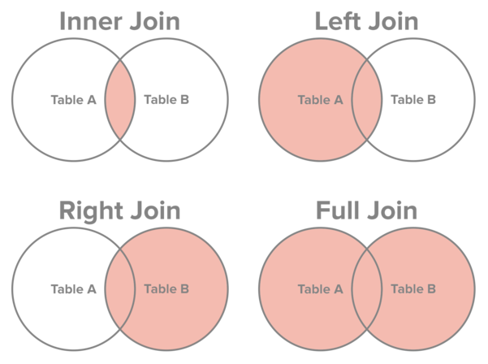

```{r setup, include=FALSE}
knitr::opts_chunk$set(echo = TRUE, eval = TRUE,
                      message = FALSE, warning = FALSE, comment = NA,
                      fig.width=8, fig.height=6)
```

## Introduction

A database is a structured set of data. Terminology is a little bit different
when working with a database management system compared to working with data in
R.

- field: variable or quantity
- record: collection of fields
- table: collection of records with all the same fields
- database: collection of tables

The relationship between R terminology and database terminology is explained
below.

| **R terminology**         | **Database terminology** |
|---------------------------|--------------------------|
| column                    | field                    |
| row                       | record                   |
| data frame                | table                    |
| types of columns          | table schema             |
| collection of data frames | database                 |

SQL (structured query language) allows you to directly interact with a database
and perform tasks such as pull data and make updates. R has two packages
available that make it easy to run SQL queries: `DBI`, `RSQLite`.

## Packages

To get started, load packages `DBI`, `RSQLite`, `tidyverse`, and `Lahman`. 
Install any packages by entering command `install.packages("package")` in your
Console pane.

Package `DBI` provides a database interface for communication 
between R and relational database management systems. Package `RSQLite`
embeds the 'SQLite' database engine in R and provides an interface compliant
with the package `DBI`.

```{r packages}
library(DBI)
library(RSQLite)
library(tidyverse)
library(Lahman)
```

## In-memory database

The below chunk of code will turn data frame `mtcars` into a database named
`mtcarsdb`. In the SQL queries that follow, you will see that the database
is referenced by name `mtcarsdb`.

At the conclusion of this RMarkdown file there is a code chunk that
closes the connection and frees resources. Run that chunk when you complete
the document.

```{r connection}
con <- dbConnect(SQLite(), ":memory:")
dbWriteTable(con, "mtcarsdb", mtcars)

# see tables
dbListTables(con)
```

## SQL to dplyr

For each SQL query with function `dbGetQuery()` in Tasks 1 - 4, think about 
what data is being pulled from the database. Then use object `mtcars` in R 
along with functions in package `dplyr` to obtain the same result.

#### Task 1

```{r task_1}
dbGetQuery(con, paste("SELECT * FROM mtcarsdb", 
                      "WHERE mpg > 20", 
                      "ORDER BY cyl")
           )
```

#### Task 2

```{r task_2}
dbGetQuery(con, paste("SELECT mpg, wt, gear FROM mtcarsdb",
                      "WHERE mpg > 25 AND wt < 3", 
                      "ORDER BY mpg DESC")
           )
```

#### Task 3

```{r task_3}
dbGetQuery(con, "SELECT COUNT(mpg) FROM mtcarsdb")
```

#### Task 4

```{r task_4}
dbGetQuery(con, paste("SELECT cyl, AVG(hp) FROM mtcarsdb",
                      "GROUP BY cyl",
                      "ORDER BY AVG(hp) DESC")
           )
```

## SQL queries

Use function `dbGetQuery()` to write SQL queries for Tasks 5 - 8. Make
use of function `paste()` to neatly format your SQL statement.

#### Task 5

Write a SQL query that returns 10 rows of the variables 
`mpg`, `gear`, and `carb`.

```{r task_5}

```

#### Task 6

Write a SQL query that returns the variables `mpg`, `gear`, and `carb` 
ordered in ascending order by `carb`.

```{r task_6}

```

#### Task 7

Write a SQL query that returns the variables `mpg`, `cyl`, and `carb`, where 
`carb` is greater than 2 and `cyl` is greater than 4.

```{r task_7}

```

#### Task 8

Write a SQL query that returns the mean `mpg`, mean `hp`, and mean `wt` 
grouped by `cyl` and then `carb`.

```{r task_8}

```

## Joins with SQL

We may want to extract information from multiple tables. 
The `JOIN` option in your SQL query will help streamline this process.

There are 4 main types of join in SQL:

  1. `INNER JOIN` or just `JOIN`: retain just the rows for each table 
     that match the condition
  2. `LEFT OUTER JOIN` or just `LEFT JOIN`: retain all rows in the first table, 
     and just the rows in the second table that match the condition
  3. `RIGHT OUTER JOIN` or just `RIGHT JOIN`: retain just the rows in the 
     first table that match the condition, and all rows in the second table
  4. `FULL OUTER JOIN` or just `FULL JOIN`: retain all rows in both tables

Fields that cannot be filled in are assigned NA values.



In package `dplyr` there are functions `left_join()`, 
`right_join()`, `inner_join()`, and `full_join()`, `semi_join()`, and
`anti_join()`.

Let's add some more tables to our in-memory database from the `Lahman` package.

```{r add_tables}
# add data frames in package Lahman to database
for (i in 1:dim(LahmanData)[1]) {
  dbWriteTable(con, LahmanData$file[i], get(LahmanData$file[i]))
}
```

To verify that all the data frames were added to the database we can run code

```{r all-tables}
# all tables
con %>%
  dbListTables()
```

#### Example

Suppose we want a table that contains the 10 players with the highest career
home run average. The table should also include each player's average career
salary. This information is across two tables in our database.

```{r batting_preview}
# fields in batting
con %>%
  dbListFields(name = "Batting")
```

```{r salaries_preview}
# fields in salaries
con %>% 
  dbListFields(name = "Salaries")
```

We can extract the information from both tables as a single table via JOIN 
on the pair: `yearID`, `playerID`. These variables form a key. The key uniquely
identifies each row of a table.

To get what we want, use

```{r top_hr_sal}
con %>% 
  dbGetQuery(paste("SELECT playerID, AVG(HR), AVG(salary)",
                    "FROM Batting JOIN Salaries USING(yearID, playerID)",
                    "GROUP BY playerID",
                    "ORDER BY Avg(HR) DESC",
                    "LIMIT 10"))
```

We could have produced the same result with `dplyr` commands

```{r top-hr-sal-dplyr}
Batting %>% 
  inner_join(Salaries, by = c("yearID", "playerID")) %>% 
  group_by(playerID) %>% 
  summarise(mean_hr = mean(HR),
            mean_salary = mean(salary)) %>%
  arrange(desc(mean_hr)) %>% 
  slice(1:10)
```

#### Task 9

Use the `JOIN` option to merge the "Batting" and "Salaries" tables by
matching `yearID` and `playerID`. Find the 10 players with 
the most strikeouts in a season since the year 2000. Also, display each
player's salary for that season in the resulting table.

```{r task_9}

```

#### Task 10

Use the `JOIN` option to merge "Salaries" and "Teams" tables by 
matching `yearID`, `playerID`, and `teamID`. Find the 10 highest salaries by 
team in 2016.

```{r task_10}

```

## Close connection

```{r close}
dbDisconnect(con)
```
